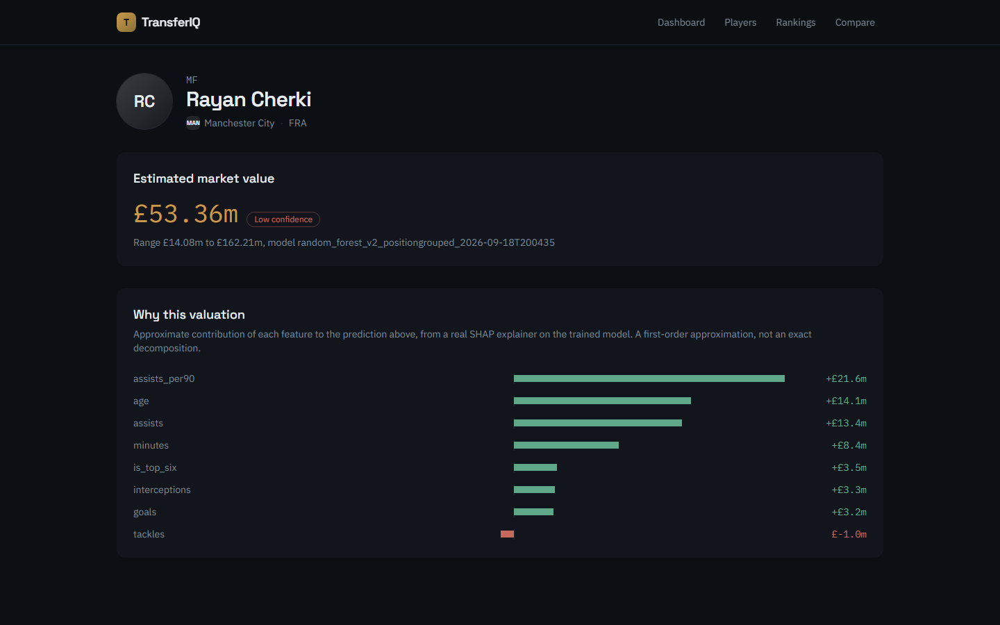
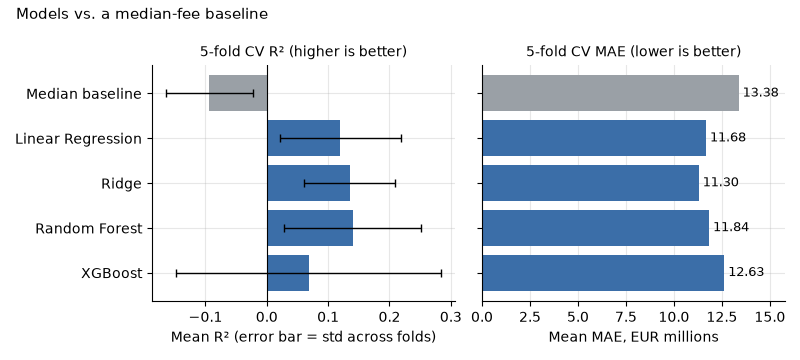
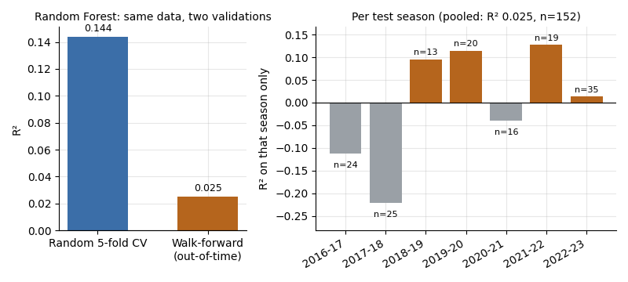
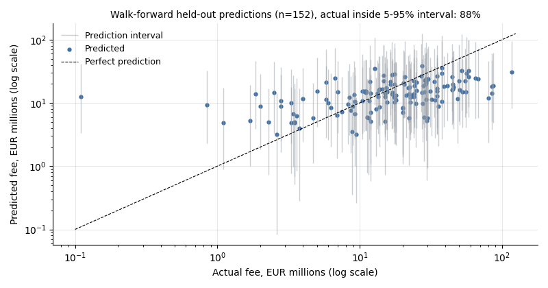
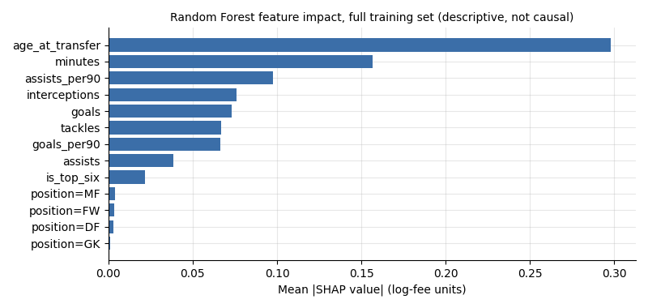
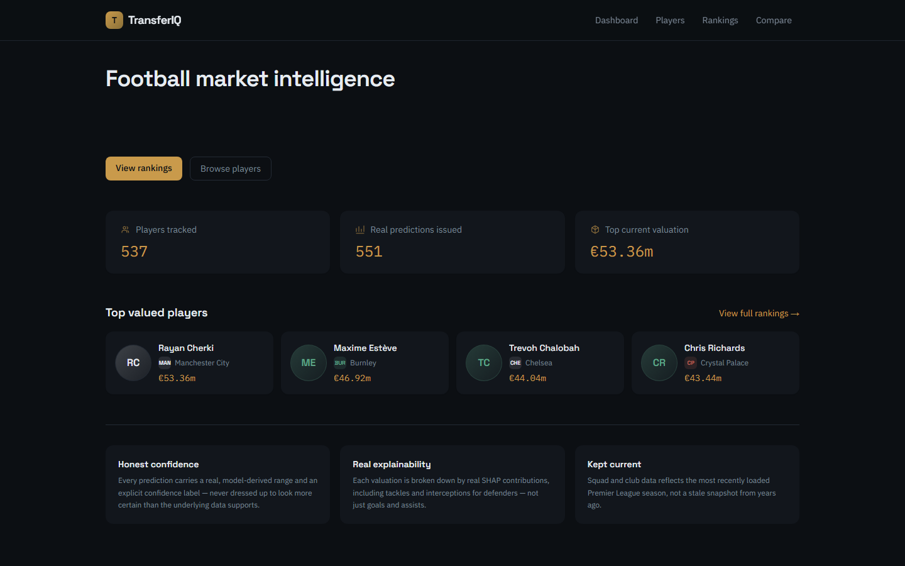
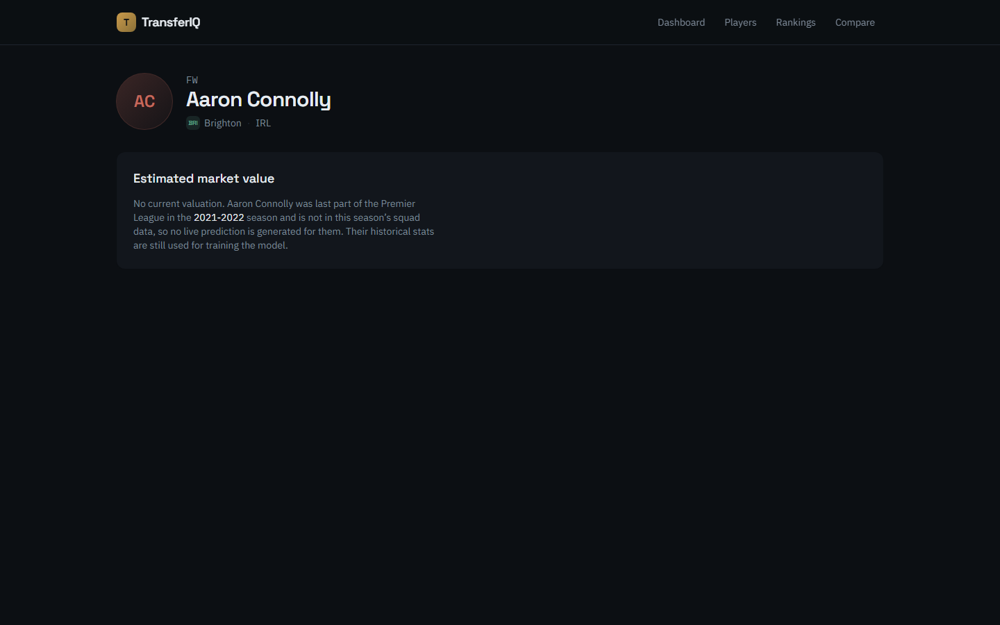
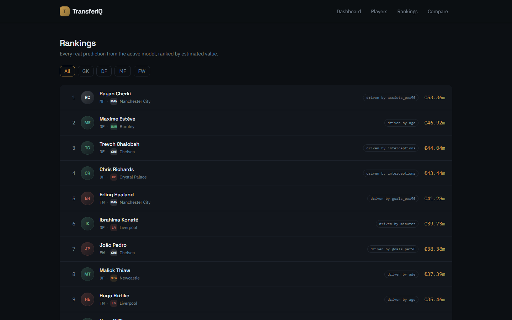
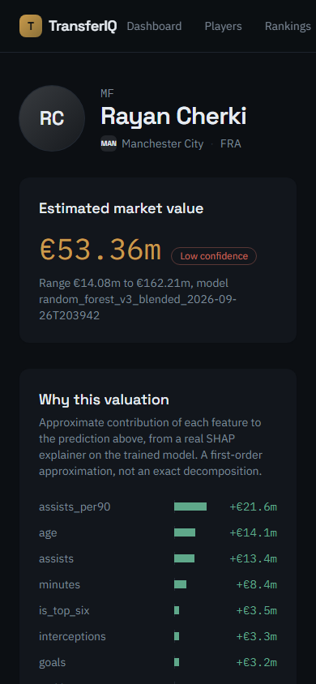
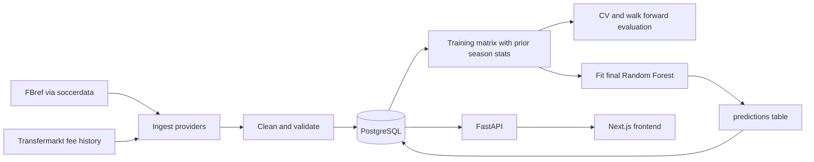

# TransferIQ

Estimates Premier League transfer fees from prior-season performance data with a trained model, and reports how weak that estimate is instead of hiding it.

[](https://github.com/codewithaymanGIT/transferiq/actions/workflows/tests.yml)



The framing is valuation under uncertainty, validated properly. The model finds a small signal. Most of the work went into measuring how small it is.

## Results in one table

185 disclosed permanent transfers, each matched to the player's stats from the season *before* the transfer. 5-fold cross-validation, target is log(fee), metrics computed on fees in EUR millions.

| Model | Mean R² | R² std across folds | Mean MAE (EUR m) |
|---|---|---|---|
| Median baseline | -0.094 | 0.071 | 13.38 |
| Linear Regression | 0.097 | 0.094 | 11.76 |
| Ridge | 0.117 | 0.057 | 11.32 |
| Random Forest (deployed) | 0.144 | 0.116 | 11.73 |
| XGBoost | -0.005 | 0.178 | 13.12 |
| Median baseline, walk-forward (out-of-time) | -0.193 | n/a | 14.24 |
| **Random Forest, walk-forward (out-of-time)** | **0.025** | n/a | **12.57** |



Every model beats a median-fee guess under random cross-validation, but not by much. Random Forest has the highest mean R² and Ridge the lowest MAE; the gap between them is well inside the fold-to-fold spread. When the model is validated the way it would be used, trained only on earlier seasons and scored on the next one, R² falls from 0.144 to 0.025. That is still clearly better than the naive baseline under the same test (R² -0.193, MAE 14.24), so the forward-looking signal is real but small. It is a pipeline demonstration, not a pricing tool.

Sources: [`docs/model-comparison.md`](docs/model-comparison.md) and [`docs/temporal-validation.md`](docs/temporal-validation.md), both written by the training scripts rather than typed by hand. Full detail is in the [model validation report](docs/model-card.md).

## Why the validation matters

**The random vs. out-of-time gap.** Random k-fold shuffles transfers from different years together, so the model can pick up fee inflation from seasons it would not have seen yet. [`temporal_validation.py`](scripts/train/temporal_validation.py) trains on every season before the test season and pools the 152 held-out predictions. The pooled R² is 0.025, against 0.144 under random CV. Individual test seasons hold only 13 to 35 transfers, so per-season R² swings from -0.222 to 0.127. The pooled number is the one to cite.



**Leakage guards.**
- A transfer in season S is joined only to stats from season S-1. [`build_training_matrix.py`](scripts/train/build_training_matrix.py) enforces this in code, and a test covers it.
- In walk-forward folds, missing values in the test fold are filled with the training fold's median, never the test fold's own.
- Loans, free transfers and undisclosed fees are excluded from the target, not recorded as zero. A player with no known birth year is skipped, not given a guessed age.

**An experiment that was reverted.** Separate models for defensive (DF, GK) and attacking (MF, FW) players scored CV R² 0.112 and -0.002, both below the single blended model's 0.140 at the time. The split was removed, and the result is recorded in [`generate_predictions.py`](scripts/train/generate_predictions.py) and the validation report. Adding `transfer_year` as a feature also made the models worse and was dropped.

**Why a naive baseline is included.** R² alone doesn't show whether a model is useful at this sample size. A median-fee guess sets the bar a model has to clear. [`train_baseline_models.py`](scripts/train/train_baseline_models.py) automatically adds a "negative result" caveat to its report whenever no model beats that bar.

**Prediction intervals.** Each live valuation carries a low/high bound. The bounds come from the 5th and 95th percentiles of out-of-fold CV residuals in log-fee space, so they reflect how wrong the model actually was on held-out data rather than the spread of its own trees. Confidence is stored as "Low" for every prediction.

On walk-forward data, with the quantiles recomputed from each fold's training seasons only, 133 of 152 actual fees (87.5%) landed inside their interval, against a 90% target. That is about one standard deviation short of the 136.8 expected, so slightly under-covering but consistent with calibration. The intervals get there by being wide. The residual quantiles are -1.315 and +1.132 in log-fee space, so the upper bound is roughly 11 times the lower. The model is honest about its uncertainty, not precise.



The chart also shows where the model fails. Held-out predictions only span €3.2m to €38.94m, while actual fees run from €0.11m to €117.5m. Every one of the 20 transfers under €5m was overpredicted. None of the 23 transfers at €40m or more was; for those, the median prediction was €18.79m against a median actual of €55.0m. The model pulls every estimate toward the middle of the market. That is why R² is near zero even though coverage is close to target.

**Monitoring for drift.** [`stability_psi.py`](scripts/train/stability_psi.py) computes the population stability index (PSI) of each feature between the training data and the 537 players being scored now. Three features exceed the usual 0.25 threshold for a significant shift: interceptions 0.365, minutes 0.290 and assists 0.273. Much of that is by design. The training rows are players later sold for a fee, who tend to be regular starters, while the live list includes every squad player. PSI cannot separate that selection effect from genuine market drift, and the [report](docs/stability-psi.md) says so.



Age at transfer has the largest average SHAP impact, followed by minutes played. These values describe what this model leans on. They are not causal effects.

## Screenshots

| Dashboard | Player with a model valuation |
|---|---|
|  |  |
| **Player with no valuation yet (API returns 404)** | **Rankings by model valuation** |
|  |  |



Screenshots are captured from the running app with real database rows by [`scripts/docs/take_screenshots.py`](scripts/docs/take_screenshots.py).

## Architecture



```
scripts/
  ingest/      provider classes (FBref, Transfermarkt, FPL fallback); raw snapshots to data/raw/
  clean/       name normalisation, type coercion, dedup
  validate/    range and schema checks before anything reaches Postgres
  transform/   per-90 stats with shrinkage, leakage-safe longitudinal features
  load/        idempotent upserts into Postgres
  train/       training matrix, model comparison, walk-forward validation, live predictions
  docs/        chart and screenshot generators for this README
backend/app/   FastAPI + SQLAlchemy models mirroring database/schema.sql
frontend/      Next.js 14 app: dashboard, players, rankings, compare, player detail
database/      schema.sql, loaded by Postgres on first container start
docs/          model card, generated evaluation reports, data-source notes
tests/         pytest suites for pipeline, model code and API
```

## Design decisions

- **Separate `market_values` and `predictions` tables.** An external benchmark and this project's own model output must never be confused. Keeping them in separate tables makes that structural.
- **The valuation endpoint returns 404 when no prediction exists.** A placeholder number in the UI would look like a real estimate.
- **Log-fee target, metrics reported in EUR.** Fees are heavily right-skewed. Training on log(fee) keeps a few very large transfers from dominating the fit. Reporting in EUR keeps the error readable.
- **Intervals from out-of-fold residuals, not tree spread.** Tree spread measures model variance and understates real out-of-sample error.
- **Out-of-time validation as the headline number.** The model would be used to price future transfers, so validating on shuffled years overstates it.
- **Missing inputs are skipped and counted, never imputed.** A guessed birth year or fee would put fabricated values into the training set.

## Run it locally

Requires Docker, Python 3.11 and Node 20+.

```bash
cp .env.example .env
docker compose up --build        # postgres :5432, API :8000 (/docs), frontend :3001
```

With an empty database the frontend shows empty states. To fill it, run the pipeline from the repo root with the `postgres` service still running. Scripts connect to `localhost:5432` by default; set `DATABASE_URL` to override.

```bash
pip install -r requirements.txt

# 1. Ingest raw snapshots (repeat --season for each season you want)
python scripts/ingest/run_ingest.py --provider fbref --season 2024-2025
python scripts/ingest/run_ingest.py --provider transfermarkt

# 2. Clean, validate and load
python scripts/load/load_to_postgres.py --season 2024-2025
python scripts/load/load_transfers.py

# 3. Train, evaluate, write predictions
python scripts/train/build_training_matrix.py
python scripts/train/train_baseline_models.py     # writes docs/model-comparison.md
python scripts/train/temporal_validation.py       # writes docs/temporal-validation.md
python scripts/train/generate_predictions.py      # writes model_versions + predictions rows

# 4. Regenerate README assets
python scripts/docs/make_charts.py
python scripts/docs/take_screenshots.py           # needs: pip install playwright
```

FBref sits behind Cloudflare. `soccerdata` drives a real browser to get through, and on some Windows machines its driver folder needs an antivirus exclusion. See [`docs/data-sources/fbref.md`](docs/data-sources/fbref.md).

## Tests

```bash
pytest tests/ -q                 # 92 passed
cd frontend && npm test          # 10 passed (Vitest)
```

The Python suite runs offline against in-memory SQLite and synthetic or fixture data. It covers:
- provider output contracts
- cleaning and validation rules
- the prior-season leakage guard and combining mid-season club stints
- idempotent loading
- the model comparison and negative-result reporting
- live-prediction logic
- the PSI calculation, including discrete features
- the API's 404-instead-of-placeholder behaviour

CI runs the Python suite on every push and pull request to `main`.

## Data sources

| Source | Used for | Licence / terms |
|---|---|---|
| [FPL API](docs/data-sources/fpl-official-api.md) | fallback provider only; implemented and tested, not loaded into the database by the current pipeline | Official public endpoint with no published open-data licence. Used for analysis, not redistribution. |
| [FBref](docs/data-sources/fbref.md) via `soccerdata` | season stats, defensive stats, birth year | No published open-data licence. FBref's stated limit of 1 request per 3 seconds is enforced in code. Raw pulls are cached and not redistributed. |
| [Transfermarkt](docs/data-sources/transfermarkt.md) via [`ewenme/transfers`](https://github.com/ewenme/transfers) | historical transfer fees in EUR millions | That repository publishes no licence and states the data was scraped in line with Transfermarkt's terms of use. |

Raw and processed data are gitignored. Two derived files are committed for reproducibility and the demo: `docs/heldout_predictions.csv` (fees and predictions only, no names) and `frontend/data/demo.json` (the demo snapshot: player names, clubs, positions, nationality and the model's outputs, with birth dates removed).

## Limitations

- **Out-of-time R² is 0.025.** Better than a naive baseline, but the model explains little of the variance in future fees. It systematically overprices cheap transfers and underprices expensive ones (see the predicted-vs-actual chart).
- **185 training rows.** Walk-forward test seasons hold 13 to 35 transfers each. Goalkeepers make up 13 training rows and are effectively unvalidated.
- **Features are narrow.** They cover minutes, goals, assists, per-90 rates, age, tackles won, interceptions, top-six club and position. The model has no data on contract length, wages, injuries or selling-club context, so it cannot tell market value apart from the fee a club would actually accept.
- **No market-value benchmark.** The `market_values` table exists but is empty, because no free, reliable source is integrated.
- **Intervals use one global width**, not a width per player or per position. Coverage is 87.5% overall but has not been checked by fee size or position.
- **Population shift.** The players being scored differ from the players the model was trained on (three features above PSI 0.25).

## What I'd do next

1. Match more historical seasons. More data is the most likely way to improve the out-of-time result; more tuning is not.
2. Add contract-length data if a source with clear terms can be found. It is the largest missing driver of fees.
3. Check interval coverage separately for cheap and expensive transfers, where a single global width is most likely to be wrong.
4. Restrict the live population to regular starters, or reweight it, and re-run PSI to separate selection effects from real drift.
